# Инструкция для работы с Git и удалёнными репозиториями

## **Что такое Git?**
*Git* - это одна из реализаций распределённых систем контроля версий, имеющая как и локальные, так и удалённые репозитории. Является самой популярной реализацией систем контроля версий в мире.
## **Подготовка репозитория**
Для создание репозитория необходимо выполнить команду *git init*  в папке с репозиторием и у Вас создаться репозиторий (появится скрытая папка *.git*)
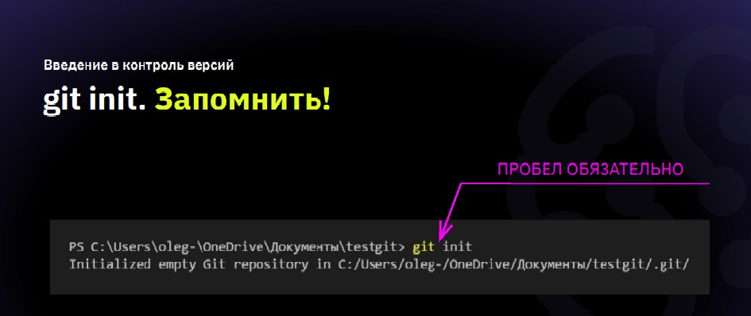
## **Создание коммитов**

### *Git add*
Для добавления измений в коммит используется команда *git add*. Чтобы использовать команду *git add* напишите *git add <имя файла>*
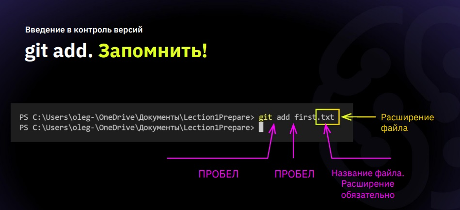
### **Просмотр состояния репозитория**
Для того, чтобы посмотреть состояние репозитория используется команда *git status*. Для этого необходимо в папке с репозиторием написать *git status*, и Вы увидите были ли измения в файлах, или их не было.

### **Создание коммитов**
Для того, чтобы создать коммит(сохранение) необходимо выполнить команду *git commit*. Выполняется она так: *git commit -m "<сообщение к коммиту>*. Все файлы для коммита должны быть ***ДОБАВЛЕНЫ*** и сообщение к коммиту писать ***ОБЯЗАТЕЛЬНО***.
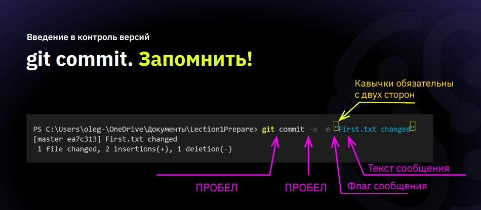
## **Перемещение между сохранениями**
Для того, чтобы перемещаться между коммитами, используется команда *git checkout*. Используется она в папке с репозиторием следующим образом: *git checkout <номер коммита>*
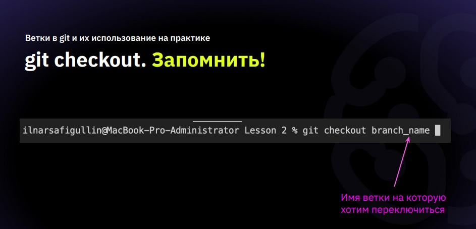
## **Журнал изменений**
Для того, чтобы посмoтреть все сделанные изменения в репозитории, используется команда *git log*. Для этого достаточно выполнить команду *git log* в папке с репозиторием
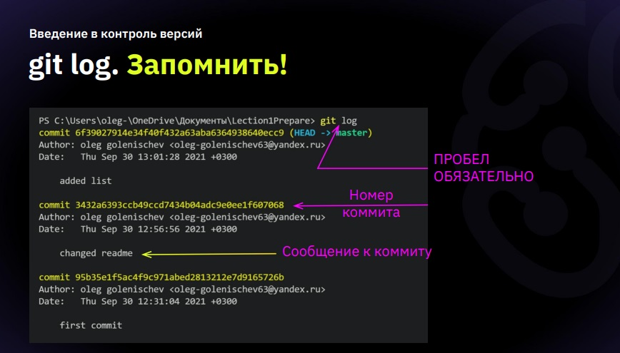
## **Ветки в Git**

### **Создание ветки**

Для того, чтобы создать ветку, используется команда *git branch*. Делается это следующим образом в папке с репозиторием: *git branch <название новой ветки>*
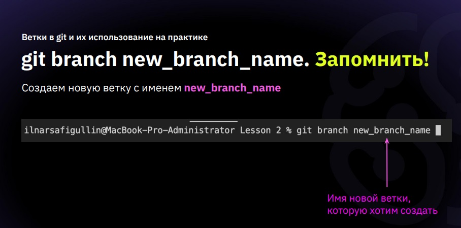
## **Слияние веток**

Для того чтобы дабавить ветку в текущую ветку используется команда *git merge <name branch>*
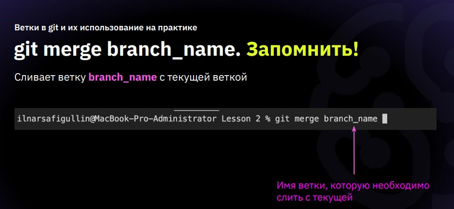
## **Удаление веток**
Для удаления ветки ввести команду "git branch -d 'name branch'"
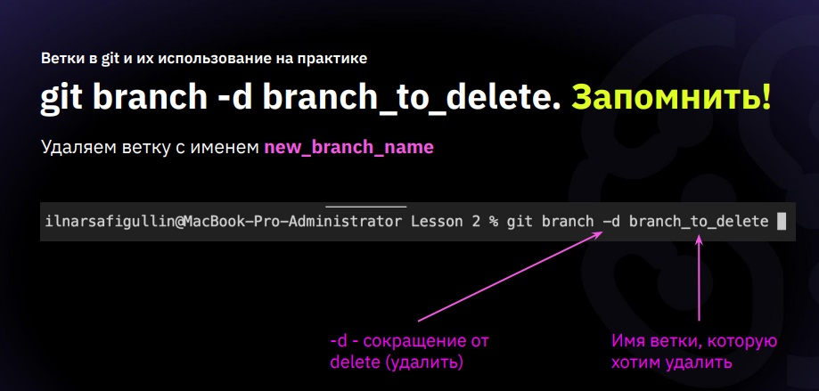
## **Работа с удаленными репозиториями**

*git clone* - эта команда позволяет склонировать внешний репозиторий на ваш ПК
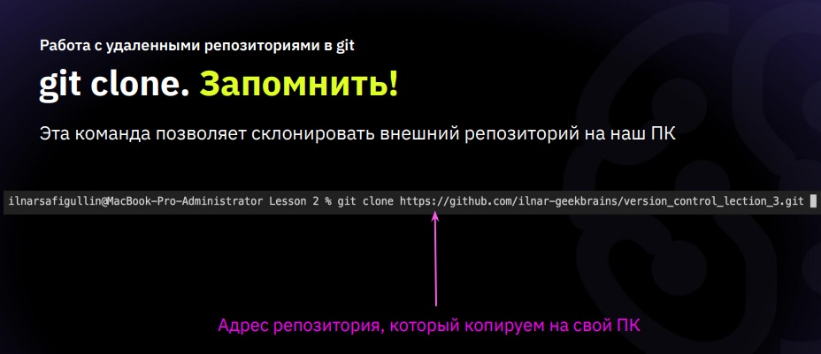
*git pull* - эта команда позволяет скачать все из текущего репозитория и автоматические сделать merge с нашей версией
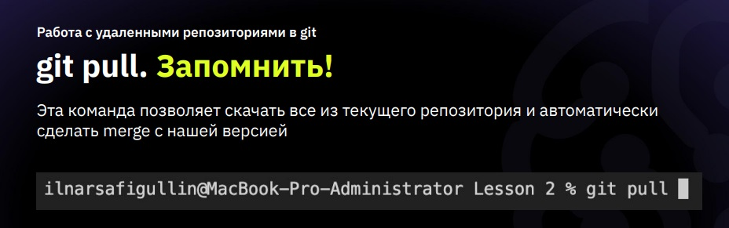
*git push* - эта команда позволяет отправить нашу версию репозитория на внешний репозиторий. **ТРЕБУЕТ АВТОРИЗАЦИИ** на внешний репозиторий.
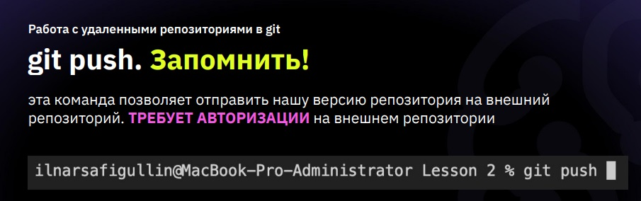
## Как сделать **pull request**
1. Делаем **fork** репозитория.
2. Делаем clone **СВОЕЙ** версии репозитория.
3. Создаем новую ветку и в **НЕЕ** вносим свои изменения.
4. Фиксируем изменения **(делаем коммит)**.
5. Отправляем свою версию в свой **GitHub.**
6. на сайте **GitHub** нажимаем кнопку **pull request.**